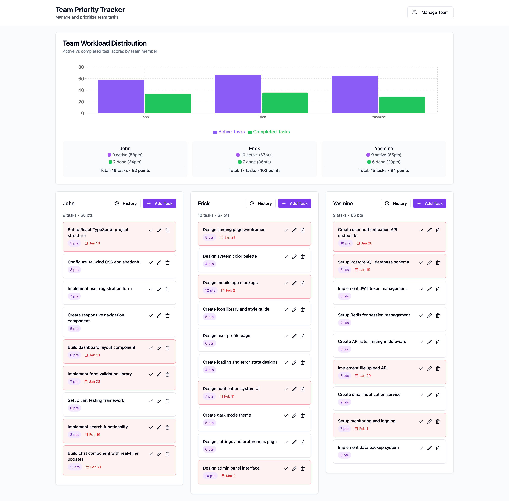

# Team Priority Tracker

A simple, intuitive React.js application for managing and visualizing task priorities across team members. Built with modern web technologies including React, TypeScript, Tailwind CSS, and shadcn/ui components.



     

## 🚀 Features

### ✨ Core Functionality
- **📝 Task Management**: Create, edit, delete, and complete tasks with titles, scores, and optional deadlines
- **✅ Task Completion System**: Mark tasks as done, view completion history, and restore completed tasks
- **🧹 Bulk Operations**: Clear all completed tasks for any team member with confirmation
- **👥 Team Member Management**: Add, edit, and remove team members with custom modal dialogs
- **🎯 Dual Drag & Drop**: 
  - Reorder tasks within team member sections
  - Reorder team members themselves
- **📊 Enhanced Workload Distribution**: Real-time stacked bar chart showing both active and completed task scores
- **📈 Task Analytics**: Visual breakdown of active vs completed tasks with color-coded indicators
- **💾 JSON Database**: Local file-based storage with automatic persistence via RESTful API
- **🔄 Auto-Recovery**: Database file created automatically if missing
- **📚 API Documentation**: Interactive Swagger UI documentation at `/api/docs`

### 🎨 User Interface
- **🎭 Modern Design**: Built with shadcn/ui components for consistent, accessible UI
- **📱 Responsive Layout**: Works seamlessly on desktop, tablet, and mobile devices
- **🎨 Purple Theme**: Beautiful purple color scheme throughout the application
- **⚡ Visual Feedback**: 
  - Color-coded task cards with deadline indicators (overdue = red, upcoming = yellow)
  - Purple score badges for task points
  - Smooth drag-and-drop animations with rotation and scaling effects
- **🚀 Custom Modals**: Professional confirmation and alert dialogs (no browser popups)
- **♿ Accessibility**: Proper ARIA labels and keyboard navigation support

### Technical Features
- **No Authentication Required**: Simple, immediate access
- **Real-time Updates**: Charts and displays update instantly when data changes
- **Type Safety**: Full TypeScript implementation
- **Component Architecture**: Modular, reusable React components

## 🛠️ Technology Stack

### Frontend
- **Framework**: React 18+ with TypeScript
- **Build Tool**: Vite 5+
- **Styling**: Tailwind CSS 3+ with custom purple theme
- **UI Components**: shadcn/ui for accessible, modern components
- **Drag & Drop**: @dnd-kit for smooth task and team member reordering
- **Charts**: Recharts for responsive workload visualization
- **Date Handling**: date-fns for deadline formatting
- **Icons**: Lucide React for consistent iconography

### Backend
- **Runtime**: Node.js 18+
- **Framework**: Express.js for RESTful API
- **Database**: JSON file-based storage (`data/data.json`)
- **API Documentation**: Swagger UI with interactive testing
- **CORS**: Enabled for local development
- **UUID**: For generating unique IDs

### Development Tools
- **TypeScript**: Full type safety with strict configuration
- **ESLint**: Code linting and formatting
- **PostCSS**: CSS processing with Tailwind
- **Playwright**: Browser automation and testing (via MCP)

## 📦 Installation

1. **Clone the repository**:
   ```bash
   git clone https://github.com/agusmakmun/team-workload-distribution.git
   cd team-priority
   ```

2. **Install dependencies**:
   ```bash
   npm install
   ```

3. **Start the development server**:
   ```bash
   npm run dev
   ```

4. **Start both servers**:
   ```bash
   # Start both API server and dev server
   npm start
   # OR start them separately:
   # npm run server  # API server on :8980
   # npm run dev     # Frontend on :5173
   ```

5. **Open your browser**:
   Navigate to `http://localhost:5173`

**Note**: The database file (`data/data.json`) is created automatically with sample data if it doesn't exist.

## 📚 API Documentation

The application includes comprehensive API documentation powered by Swagger UI:

- **Access URL**: http://localhost:8980/api/docs
- **Interactive Testing**: Test all API endpoints directly from the browser
- **Complete Schemas**: Full data model documentation for Task, TeamMember, and AppData
- **Request/Response Examples**: See exactly what data to send and expect back

### Available API Endpoints:
- `GET /api/data` - Retrieve all application data
- `PUT /api/data` - Update all application data
- `POST /api/tasks` - Create a new task
- `PUT /api/tasks/{id}` - Update an existing task
- `DELETE /api/tasks/{id}` - Delete a task
- `PUT /api/tasks/reorder` - Reorder tasks within team member sections
- `PUT /api/team-members/reorder` - Reorder team member display order
- `GET /api/health` - API health check

The Swagger documentation provides detailed request/response schemas, example payloads, and allows you to test API calls directly from the interface.

### 🐳 Docker Installation (Alternative)

If you prefer using Docker:

```bash
# Clone the repository
git clone https://github.com/agusmakmun/team-workload-distribution.git
cd team-priority

# Run with Docker Compose
docker-compose up -d

# View logs
docker-compose logs -f

# Stop the application
docker-compose down
```

The application will be available at:
- **Frontend**: http://localhost:5173
- **API**: http://localhost:8980
- **API Docs**: http://localhost:8980/api/docs

## 📊 Database

The application uses a local JSON file (`data/data.json`) for data persistence. This file is automatically created by the server and contains all team members and tasks.

### Important Notes:
- The `data/data.json` file is ignored by Git to prevent committing local data
- Use `data/data.json.sample` as a template for the database structure
- The API server automatically manages data persistence and provides RESTful endpoints

## 🎯 Usage

### Getting Started
The application comes with sample data including three team members (John, Doe, Felix) and example tasks to help you get started immediately.

### Managing Team Members
1. Click **"Manage Team"** in the header
2. Add new members by entering their name and clicking **"Add"**
3. Edit existing members by clicking the edit icon
4. Delete members using the trash icon (requires confirmation)

### Creating Tasks
1. Click **"Add Task"** within any team member's card
2. Fill in the task details:
   - **Title**: Descriptive name for the task
   - **Score**: Numerical value (1-100) representing complexity/effort
   - **Assign to**: Team member (pre-selected based on which card you clicked)
   - **Deadline**: Optional due date
3. Click **"Create Task"**

### Managing Tasks
- **✏️ Edit**: Click the edit icon on any task card to modify details
- **🗑️ Delete**: Click the trash icon (shows custom confirmation modal)
- **✅ Mark as Done**: Click the checkmark icon to complete tasks
- **📜 View History**: Click the "History" button to see completed tasks for each team member
- **🔄 Restore Tasks**: Restore completed tasks back to active status from history view
- **🧹 Clear All**: Remove all completed tasks for a team member (with confirmation)
- **🎯 Reorder Tasks**: Drag and drop tasks within a team member's section to change priority
- **📊 Visual Indicators**: 
  - 🟡 Yellow background: Deadline within 3 days
  - 🔴 Red background: Overdue tasks
  - 🟣 Purple score badges: Task complexity points
  - 🟢 Green background: Completed tasks in history view

### Team Member Management
- **👥 Reorder Members**: Drag and drop entire team member cards to change display order
- **✏️ Edit Members**: Click edit icon in team management dialog
- **🗑️ Delete Members**: Custom modal with warning about task deletion
- **⚠️ Validation**: Prevents deletion of last team member

### Understanding the Chart
The enhanced stacked bar chart at the top shows:
- **X-axis**: Team member names
- **Y-axis**: Task scores (stacked view)
- **Purple Bars**: Active task scores (current workload)
- **Green Bars**: Completed task scores (achievement tracking)
- **Legend**: Color-coded legend for easy interpretation
- **Summary Cards**: Detailed stats showing active/completed task counts and scores
- **Real-time Updates**: Chart updates instantly when tasks are completed or restored

## 🏗️ Project Structure

```
src/
├── components/           # React components
│   ├── Header.tsx       # Application header with actions
│   ├── WorkloadChart.tsx # Enhanced stacked bar chart visualization
│   ├── TaskCard.tsx     # Individual task display with completion controls
│   ├── TaskHistoryDialog.tsx # Completed task history and management
│   ├── TeamMemberSection.tsx # Team member task lists with history access
│   ├── TaskFormDialog.tsx # Task creation/editing modal
│   ├── TeamManagementDialog.tsx # Team management modal
│   └── ui/              # shadcn/ui components (button, dialog, card, etc.)
├── lib/                 # Utility functions
│   ├── jsonFileStorage.ts # Enhanced data persistence with completion tracking
│   └── utils.ts         # General utilities
├── types/               # TypeScript type definitions
│   └── index.ts         # App-wide type definitions (Task, TeamMember, AppData)
├── App.tsx              # Main application component
├── main.tsx             # Application entry point
└── index.css            # Global styles and Tailwind imports
```

## 🔧 Development

### Available Scripts

- `npm run dev` - Start development server
- `npm run build` - Build for production
- `npm run preview` - Preview production build
- `npm run lint` - Run ESLint

### Key Components

#### JsonFileStorage Class
Handles all data operations including:
- Loading/saving to JSON file via REST API
- CRUD operations for tasks and team members  
- Task completion and history management
- Task reordering and priority management
- Workload calculations with active/completed breakdown
- Bulk operations (clear all completed tasks)

#### Drag & Drop System
Built with @dnd-kit for:
- Smooth drag animations
- Accessibility support
- Touch device compatibility
- Visual feedback during drag operations

#### Type Safety
Complete TypeScript coverage with interfaces for:
- `Task`: Individual task data structure with completion status and timestamps
- `TeamMember`: Team member information
- `AppData`: Complete application state including completedTasks array
- Extended task properties: status, completedAt, active/completed tracking

## 🎨 Customization

### Styling
The application uses Tailwind CSS with CSS variables for theming. Key customization points:

- **Colors**: Modify CSS variables in `src/index.css`
- **Component Styles**: Update shadcn/ui component files in `src/components/ui/`
- **Layout**: Adjust grid layouts in main components

### Data Structure
Extend the data model by:
1. Adding fields to TypeScript interfaces in `src/types/index.ts`
2. Updating the storage layer in `src/lib/storage.ts`
3. Modifying UI components to display new fields

## 📋 Roadmap

### Potential Future Enhancements
- **Multi-team Support**: Handle multiple teams in one instance
- **Cloud Storage**: Sync data across devices
- **User Authentication**: Personal workspaces
- **Advanced Reporting**: Time tracking and analytics
- **Task Templates**: Predefined task types and categories
- **Due Date Notifications**: Email/browser notifications for deadlines
- **Bulk Task Operations**: Multi-select and batch operations
- **Task Comments**: Add notes and updates to tasks
- **Time Tracking**: Log hours spent on completed tasks
- **Mobile App**: Native mobile version
- **Real-time Collaboration**: Live updates across users
- **Integration APIs**: Connect with external tools (Slack, Jira, GitHub)
- **Advanced Filtering**: Search and filter capabilities
- **Export/Import**: CSV, Excel, and JSON data export

## 🤝 Contributing

1. Fork the repository
2. Create a feature branch (`git checkout -b feature/amazing-feature`)
3. Commit your changes (`git commit -m 'Add amazing feature'`)
4. Push to the branch (`git push origin feature/amazing-feature`)
5. Open a Pull Request

## 📄 License

This project is open source and available under the [MIT License](LICENSE).

## 🙏 Acknowledgments

- [shadcn/ui](https://ui.shadcn.com/) for the beautiful component library
- [Recharts](https://recharts.org/) for the charting functionality
- [dnd-kit](https://dndkit.com/) for the drag-and-drop system
- [Tailwind CSS](https://tailwindcss.com/) for the utility-first CSS framework

## 📄 License

This project is licensed under the MIT License - see the [LICENSE](LICENSE) file for details.

### MIT License Summary
- ✅ **Commercial use** - Use this project in commercial applications
- ✅ **Modification** - Modify the source code as needed
- ✅ **Distribution** - Distribute the original or modified code
- ✅ **Private use** - Use privately without restrictions
- ⚠️ **Liability** - No warranty or liability provided
- ⚠️ **License notice** - Include the original license and copyright notice

---

**Built with ❤️ using React and TypeScript**